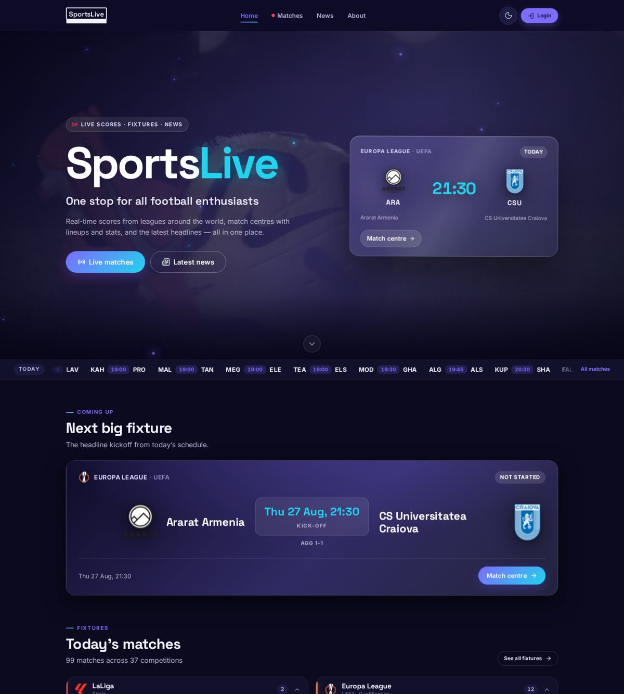
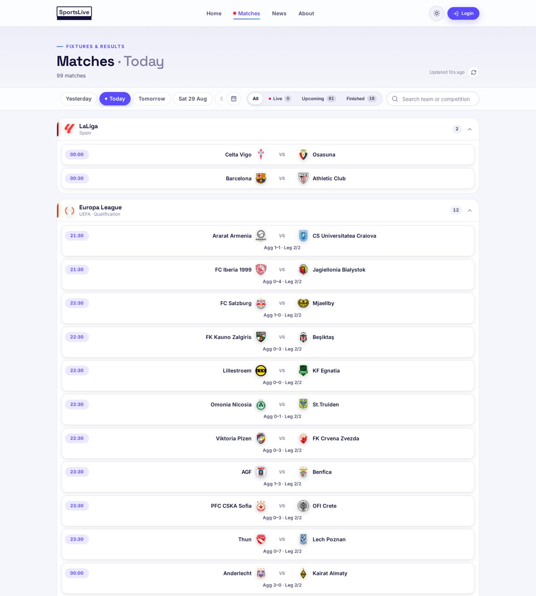
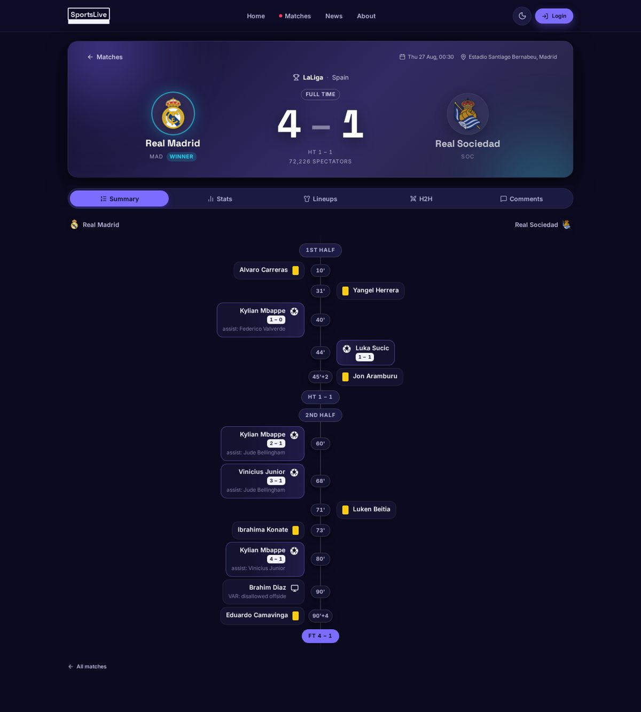
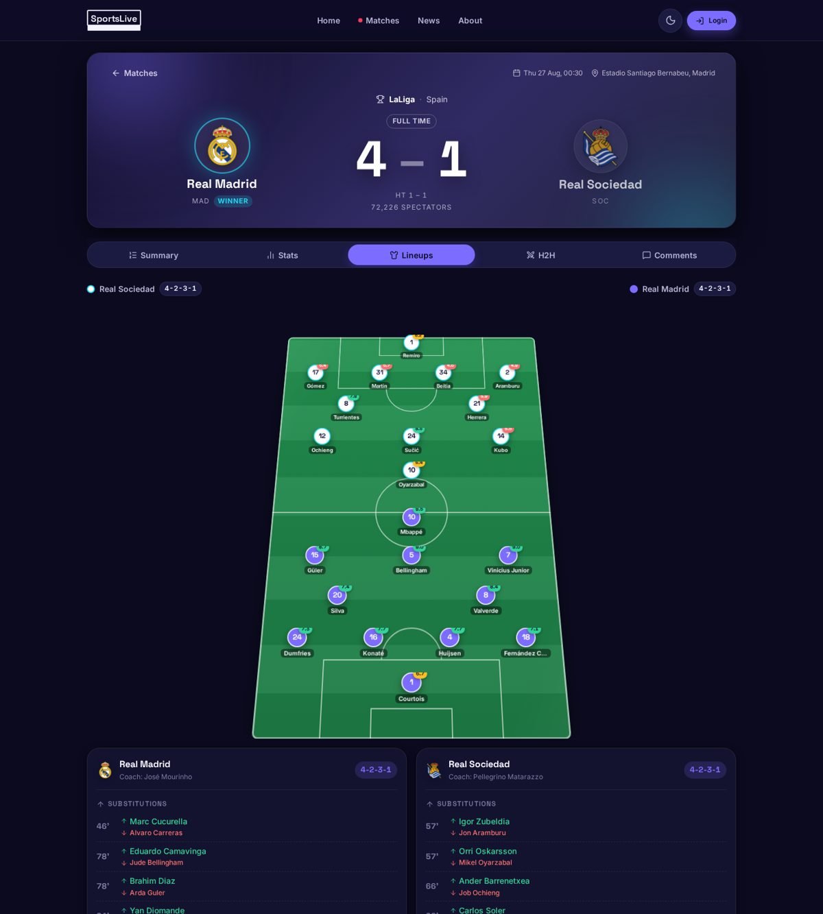
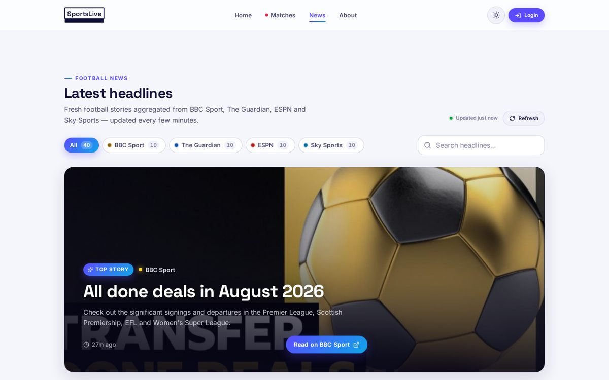
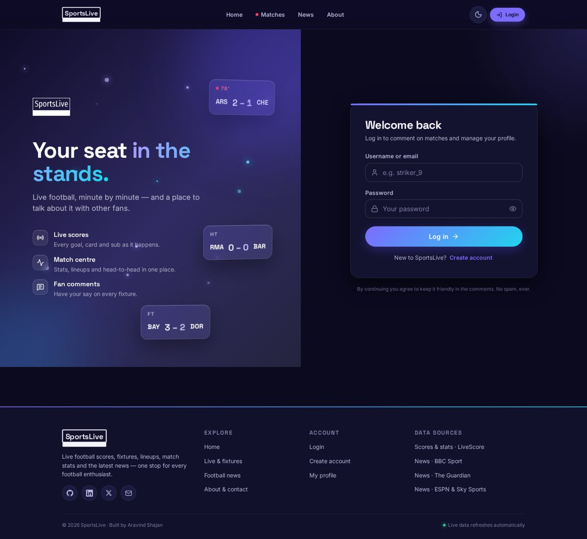

# ⚽ SportsLive

Live football scores, fixtures, lineups, match stats and the latest football news — one stop for every football enthusiast.

**Live:** https://sports-live-api.netlify.app/ · **API:** https://sportslive.onrender.com/api/health

| Frontend | Backend | Infra |
| --- | --- | --- |
| React 19 · Vite 6 · React Router 7 · anime.js 4 · CSS Modules · lucide-react · react-toastify | Node 20+ · Express 5 · Mongoose 8 (MongoDB) · JWT + bcrypt · zod · helmet · express-rate-limit · rss-parser | Docker Compose · nginx (static + `/api` proxy) · MongoDB 7 |

## Features

- **Live scores** — every live match, auto-refreshing every 60 s, grouped by competition with a live ticker on the home page.
- **Fixtures & results** — browse any date (yesterday / today / tomorrow / date picker), filter live / upcoming / finished, search by team or competition.
- **Match centre** — score header with countdown/minute, key-events timeline (goals, cards, subs, assists), animated stat bars, a 3D formation pitch with both lineups, bench & substitutions, head-to-head history, and fan comments.
- **News hub** — latest football headlines aggregated from BBC Sport, The Guardian, ESPN and Sky Sports (RSS), filter by source, search.
- **Accounts** — sign up / log in (JWT), edit profile, change password, see your own comments.
- **Dark & light themes** — follows your OS preference, one-click toggle, persisted.
- **Modern UI** — custom 3D animations with anime.js (hero scoreboard parallax, 3D tilt cards, flip login card, 3D pitch, score count-ups), fully responsive, accessible.

## Project structure

```
SportsLive/
├─ backend/            Express API (see backend/README section below)
│  ├─ server.js
│  ├─ src/{app.js, config, lib, middleware, models, routes, services}
│  ├─ tests/           node:test unit tests + fixtures
│  └─ .env.example
├─ frontend/           React + Vite app
│  ├─ src/{components, context, features, hooks, lib, pages, styles}
│  ├─ public/          logos, hero video, _redirects (Netlify SPA fallback)
│  └─ Dockerfile, nginx.conf
├─ docker-compose.yml  mongo + backend + frontend (only the frontend port is published)
├─ .env.docker.example
└─ netlify.toml
```

## Run everything with Docker (recommended)

One command brings up MongoDB, the API and the web app. **Only the frontend port is published** — nginx serves the built app and proxies `/api` to the backend over the private compose network, so the API and database are never exposed on the host.

```bash
cp .env.docker.example .env      # set RAPIDAPI_KEY and JWT_SECRET (FRONTEND_PORT defaults to 8080)
docker compose up -d --build
# → http://localhost:8080
```

- `docker compose ps` — status/health of the three services · `docker compose logs -f backend` — API logs · `docker compose down` — stop (`-v` also deletes the MongoDB volume).
- Images: `backend/Dockerfile` (node:22-alpine, production deps only), `frontend/Dockerfile` (multi-stage: Vite build → nginx:alpine with `frontend/nginx.conf`).
- The frontend is built with `VITE_API_URL=/`, which makes it call the API on the same origin (`/api/...`).

## Getting started (without Docker)

Requirements: Node ≥ 20.18, a MongoDB instance (Atlas or local — e.g. `docker run -d --name sportslive-mongo -p 27017:27017 mongo:7`), and a RapidAPI key for [LiveScore Sports](https://rapidapi.com/) (`livescore-sports.p.rapidapi.com`).

```bash
# 1) backend
cd backend
cp .env.example .env        # fill in MONGO_URI, JWT_SECRET, RAPIDAPI_KEY
npm install
npm run dev                  # http://localhost:4000

# 2) frontend (new terminal)
cd frontend
npm install
npm run dev                  # http://localhost:5173
```

The frontend reads the API base URL from `VITE_API_URL` (`frontend/.env.development` → `http://localhost:4000`, `frontend/.env.production` → the Render URL).

### Backend environment (`backend/.env`)

| Variable | Description |
| --- | --- |
| `PORT` | Port to listen on (default `4000`) |
| `MONGO_URI` | MongoDB connection string (legacy name `mongoAtlasURI` is still read) |
| `JWT_SECRET` | Secret used to sign JWTs (legacy name `SECRET_KEY` is still read) |
| `RAPIDAPI_KEY` | RapidAPI key for `livescore-sports.p.rapidapi.com` |
| `CORS_ORIGINS` | Comma-separated list of allowed origins (default `*`) |
| `NODE_ENV` | `development` / `production` |

### Scripts

| Location | Script | What it does |
| --- | --- | --- |
| `backend` | `npm run dev` / `npm start` / `npm test` | watch mode / production / unit tests |
| `frontend` | `npm run dev` / `npm run build` / `npm run lint` / `npm run preview` | dev server / production build / ESLint / preview build |

## API

All endpoints are prefixed with `/api` and return JSON. Errors have the shape `{ "error": { "message", "code?", "details?" } }`. Protected routes expect `Authorization: Bearer <token>`.

| Method | Path | Description |
| --- | --- | --- |
| GET | `/health` | Uptime + DB status |
| GET | `/matches/live` | Live matches grouped by competition |
| GET | `/matches?date=YYYY-MM-DD` | Fixtures/results for a date (default today) |
| GET | `/matches/:id` | Scoreboard / match detail |
| GET | `/matches/:id/lineups` | Lineups, bench, substitutions |
| GET | `/matches/:id/statistics` | Match statistics |
| GET | `/matches/:id/incidents` | Key events timeline |
| GET | `/matches/:id/h2h` | Head-to-head history |
| GET / POST 🔒 | `/matches/:id/comments` | Fan comments (POST requires auth) |
| POST | `/auth/signup`, `/auth/login` | Create account / sign in → `{ user, token }` |
| GET 🔒 | `/auth/me` | Current user |
| PUT 🔒 | `/users/me` | Update username / email / password |
| GET 🔒 | `/users/me/comments` | The current user's comments |
| GET | `/news?source=all\|bbc\|guardian\|espn\|sky&limit=40` | Aggregated football news |
| POST | `/contact` | Contact form |

Upstream responses are cached in memory (30 s – 10 min depending on the route) and rate-limited per IP.

## Deployment

- **Render (blueprint)**: `render.yaml` defines the API (`sportslive`, Node web service, root `backend`, health check `/api/health`) and the web app (`sportslive-web`, static site, root `frontend`, SPA rewrite). Dashboard → *New → Blueprint* → select this repo, then provide `MONGO_URI` and `RAPIDAPI_KEY` when prompted (`JWT_SECRET` is generated). To reuse the existing `sportslive` service instead, set its build command to `npm ci`, start command to `node server.js`, root dir `backend`, and add the env vars above (`RAPIDAPI_KEY` is required now that the key is no longer in the code; legacy `mongoAtlasURI`/`SECRET_KEY` names still work).
- **Netlify (frontend alternative)**: `netlify.toml` builds `frontend/` and publishes `dist/` with an SPA fallback.
- **Docker**: see "Run everything with Docker" above.

## Notes

- v2 (2026) is a full rewrite: the old Bootstrap/jQuery UI, plaintext-password auth and dead news/commentary endpoints were replaced. Accounts created before v2 need to be re-created (passwords are now hashed).
- Data: scores & stats by LiveScore (via RapidAPI); news via public RSS feeds of BBC Sport, The Guardian, ESPN and Sky Sports.

## Screenshots

| Home (dark) | Matches (light) |
| --- | --- |
|  |  |

| Match centre — summary | Match centre — 3D lineups |
| --- | --- |
|  |  |

| News (light) | Login (dark) |
| --- | --- |
|  |  |
